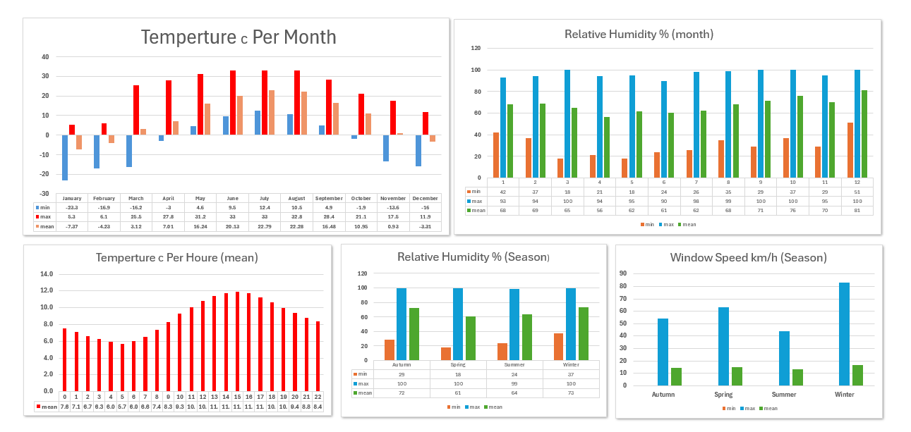
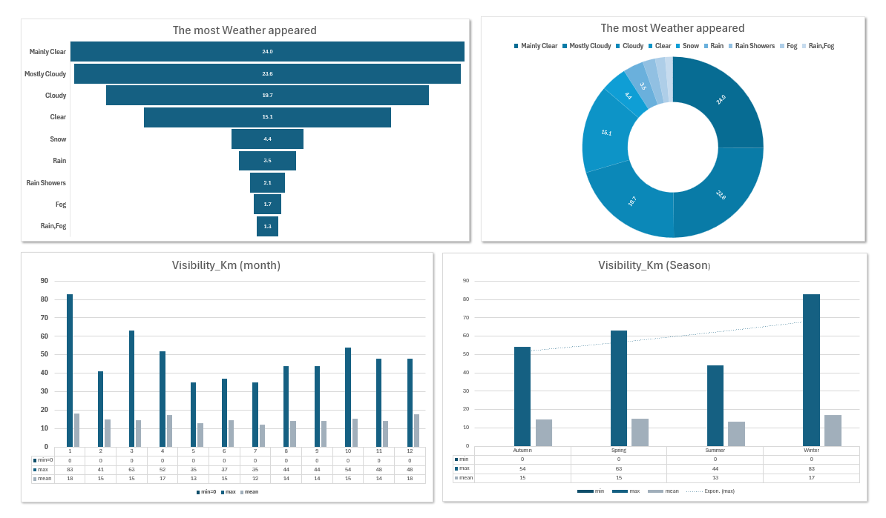

<h1 align="center">🌦️ Weather Data Analysis using Python</h1>

<p align="center">
  End-to-End Exploratory Data Analysis (EDA) of hourly weather observations using Python.
</p>

<p align="center">


</p>

---

# 📖 Project Overview

This project performs a complete Exploratory Data Analysis (EDA) on one year of hourly weather observations.

The workflow covers the entire data analysis lifecycle, beginning with raw data preparation and ending with meaningful business-oriented insights supported by statistical analysis and visualizations.

The project demonstrates practical data analysis skills including data cleaning, feature engineering, aggregation, correlation analysis, time-series exploration, and insight generation using Python.

---

# 🎯 Objectives

- Prepare and clean raw weather data.
- Validate data quality.
- Engineer new time-based features.
- Analyze weather trends across different time periods.
- Discover relationships between weather variables.
- Generate visual insights for decision-making.
- Answer practical business questions using data.

---

# 📊 Dataset Summary

| Metric | Value |
|---------|-------|
| Dataset | Weather Data |
| Records | 8,784 |
| Original Features | 8 |
| Engineered Features | 7 |
| Time Period | January 2012 – December 2012 |
| Frequency | Hourly |
| Missing Values | 5 |
| Duplicate Records | 4 |

---

# 🛠 Technologies

- Python
- Pandas
- NumPy
- Matplotlib
- Seaborn
- Jupyter Notebook

---

# 🧹 Data Preparation

The following preprocessing steps were completed before analysis:

- Converted Date/Time into datetime format.
- Verified data quality.
- Checked missing values.
- Checked duplicate records.
- Created Year feature.
- Created Month feature.
- Created Month Name feature.
- Created Day feature.
- Created Hour feature.
- Created Weekday feature.
- Created Season feature.

---

# 🔄 Analysis Workflow

```text
Raw Dataset
      │
      ▼
Data Cleaning
      │
      ▼
Data Validation
      │
      ▼
Feature Engineering
      │
      ▼
Exploratory Data Analysis
      │
      ▼
Statistical Analysis
      │
      ▼
Visualization
      │
      ▼
Business Insights
```

---

# 📈 Exploratory Data Analysis

The analysis includes:

- Seasonal Weather Analysis
- Monthly Trend Analysis
- Hourly Trend Analysis
- Temperature Analysis
- Humidity Analysis
- Wind Speed Analysis
- Visibility Analysis
- Atmospheric Pressure Analysis
- Weather Condition Distribution
- Correlation Analysis

---

# 💼 Business Questions

| Business Question | Why It Matters |
|-------------------|----------------|
| Which season records the highest average temperature? | Supports seasonal planning and operational preparation. |
| Which month experiences the strongest winds? | Useful for transportation, construction, and infrastructure planning. |
| During which hours is visibility at its lowest? | Helps improve road safety and airport operations. |
| Which weather condition occurs most frequently? | Supports maintenance planning and operational forecasting. |
| How does humidity relate to temperature? | Helps understand environmental behavior and climate patterns. |
| Which season records the lowest atmospheric pressure? | Useful for monitoring unstable weather conditions. |
| What time of day experiences the strongest wind speeds? | Supports renewable energy and outdoor activity planning. |

---

# 📊 Visualizations

## Monthly Temperature Trend

<p align="center">

</p>

---

## Most Weather & Visibility

<p align="center">

</p>

---

# 📌 Key Insights

- Weather patterns change significantly across seasons.
- Feature engineering enabled detailed temporal analysis.
- Correlation analysis identified relationships between key weather variables.
- Weather conditions exhibit distinct seasonal behavior.
- Hourly trends reveal daily environmental changes.

---

# 📂 Project Structure

```text
Weather-Data-Analysis
│
├── data
│   └── Weather_Data.csv
│
├── notebooks
│   └── Weather_Analysis.ipynb
│
├── images
│   ├── banner.png
│   ├── monthly_temperature.png
│   └── correlation_heatmap.png
│
├── README.md
├── requirements.txt
├── LICENSE
└── .gitignore
```

---

# 🚀 Skills Demonstrated

- Data Cleaning
- Data Validation
- Feature Engineering
- Exploratory Data Analysis (EDA)
- Statistical Aggregation
- Time-Series Analysis
- Correlation Analysis
- Data Visualization
- Business Insight Generation

---

# 🔮 Future Improvements

- Develop an interactive Power BI dashboard.
- Build a Streamlit web application.
- Apply predictive machine learning models.
- Compare multiple years of weather observations.
- Automate report generation.

---

# 📬 Contact

**Haider Lafta**

Aspiring Data Analyst | Business Intelligence Analyst

- GitHub: https://github.com/haiderlaftada
- LinkedIn: https://www.linkedin.com/in/haider-lafta-dakhil-a63a22348/

---

# ⭐ Executive Summary

This project demonstrates an end-to-end exploratory data analysis workflow using Python. Starting from raw hourly weather observations, the data was cleaned, transformed, explored, and visualized to uncover meaningful trends and relationships. The resulting insights illustrate how analytical techniques can transform raw environmental data into valuable information that supports informed decision-making.
